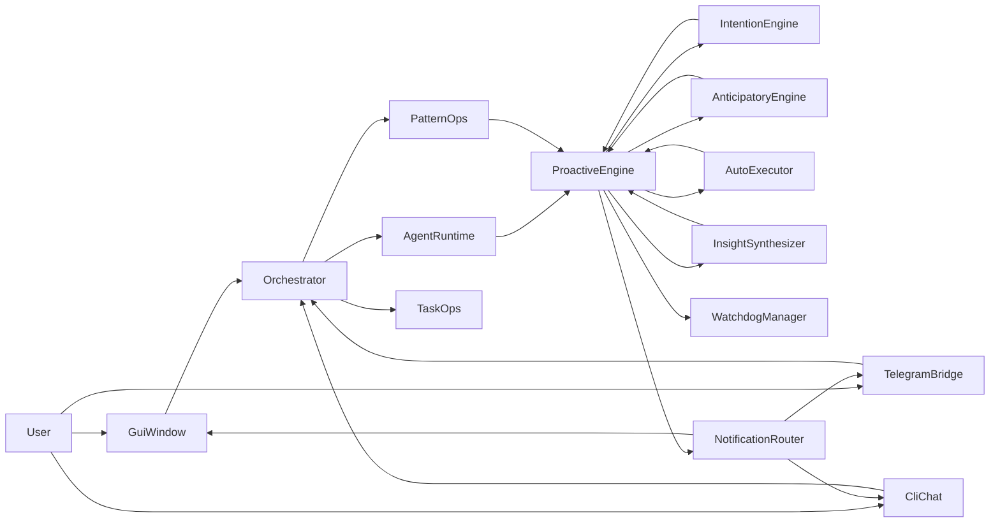

# A.N.K.I.T.A Jarvis-Proactive Implementation Plan

## High-level Goals

- **Flip from reactive to proactive**: Implement all 12 features from `todo.md` so ANKITA can anticipate, act, and speak first.
- **Unify delivery**: Route proactive intelligence consistently through GUI, CLI, and Telegram with priorities, DND, and batching.
- **Stay safe and observable**: Persist all proactive state under `.ankita/state/`, log autonomous actions, and keep low-risk by default.

## Architecture Overview

- **Core runtime**:
  - `AgentRuntime` + `Orchestrator` in `[agent_runtime.py](agent_runtime.py)` and `[agents/orchestrator.py](agents/orchestrator.py)` remain the main request pipeline.
  - Proactive features hang off `[proactive.py](proactive.py)` and new agents, feeding events into a queue.
- **New proactive agents/modules**:
  - `[agents/intention_engine.py](agents/intention_engine.py)` — builds `intent.json` from memory, tasks, cron, git, and watchdogs.
  - `[tools/pattern_ops.py](tools/pattern_ops.py)` — logs interaction fingerprints into `patterns.jsonl` and derives `behavioral_model.json` weekly.
  - `[agents/anticipatory_engine.py](agents/anticipatory_engine.py)` — prefetches likely-needed data into `prefetch_cache.json`.
  - `[agents/morning_agent.py](agents/morning_agent.py)` — composes first-boot-of-day briefings.
  - `[agents/auto_executor.py](agents/auto_executor.py)` — safe autonomous background actions with `auto_actions_log.json`.
  - `[agents/insight_synthesizer.py](agents/insight_synthesizer.py)` — cross-agent, cross-day insight generation.
  - `[agents/notification_router.py](agents/notification_router.py)` — central routing, dedup, formatting, and history for proactive events.
- **State & logs** (all under `.ankita/state/`):
  - `proactive_state.json`, `intent.json`, `behavioral_model.json`, `prefetch_cache.json`, `notifications.jsonl`, `auto_actions_log.json`, `patterns.jsonl`.

### Proactive Dataflow (Mermaid)

## Step 1: Proactive State Persistence (Proactive 12)

- **Extend `ProactiveEvent` and `ProactiveEngine` in `[proactive.py](proactive.py)`**:
  - Introduce `proactive_state.json` at `.ankita/state/proactive_state.json` with fields from `todo.md` (e.g., `last_morning_briefing_date`, `last_intent_refresh`, `last_insight_synthesis`, `last_pattern_analysis`, `last_intent_refresh`, `delivered_notification_ids`, `dnd_active`).
  - On engine init, load this file if present; else start with sane defaults and create it.
  - Wrap updates (e.g., when firing morning briefings, insights, pattern runs) with a helper that atomically writes the updated JSON to disk.
  - Ensure idle/DreamState and Sentinel flags are compatible with persisted state (but keep DreamAgent disabled as currently short-circuited).

## Step 2: Priority System, DND, and Batching (Proactive 5)

- **Upgrade `ProactiveEvent` in `[proactive.py](proactive.py)`**:
  - Add fields: `priority` (`low|medium|high|critical`), `urgency` (`immediate|next_idle|next_session`), `interruptible` (bool), and `id` (stable identifier for dedup).
  - Default existing system/cron/drop-file events to `priority="medium"`, `urgency="next_idle"` unless explicitly overridden.
- **Add DND schedule support**:
  - Parse `ANKITA_DND_HOURS` (e.g., `"23-7"`) into quiet hours and store in `proactive_state`.
  - During DND, only allow `critical` events through immediately; re-tag others as `next_session` for later delivery.
- **Batching & delivery rules in consumers**:
  - In GUI `[gui.py](gui.py)` `_on_proactive_tick`, instead of directly appending each event:
    - Pull events, let a small helper categorize them by `priority/urgency`, and batch `low`/`medium` `next_idle` events into a textual summary every N minutes.
    - Render severity hints (e.g., `🚨` for `critical`, `🔔` for `high`) but keep visuals consistent with current style.
  - In Telegram `[telegram_bot.py](telegram_bot.py)` `_flush_proactive_events`, apply the same priority rules to decide which events ping immediately vs group.
  - Track delivered IDs in `proactive_state.delivered_notification_ids` to avoid cross-channel dupes on restart.

## Step 3: Morning Briefing Agent (Proactive 4)

- **New `[agents/morning_agent.py](agents/morning_agent.py)`**:
  - Implement `MorningAgent.generate_briefing(intent, tasks, watchdog_state, system_stats, cron_today)` that calls the LLM with a strict schema (max ~150 words, spoken-friendly, bullet-ish output).
  - Use `intent.json`, TaskAgent via `task_op(action="list")`, WatchdogManager status, and simple system checks for disk/battery.
- **Wire into `ProactiveEngine`**:
  - On startup and when `set_last_interaction()` detects a new day vs `proactive_state.last_morning_briefing_date`, call `MorningAgent` once and emit `ProactiveEvent(kind="morning_briefing", priority="high", urgency="immediate", interruptible=True)`.
  - Update `proactive_state.last_morning_briefing_date` after a successful event.
- **GUI/Telegram handling**:
  - In `[gui.py](gui.py)` `_on_proactive_tick`, detect `kind="morning_briefing"` and render with a dedicated prefix (e.g., "Morning"), plus optional TTS via Sarvam if configured.
  - In `[telegram_bot.py](telegram_bot.py)`, map morning briefings to a rich, single message (not intermixed with other alerts) and mark as `high` priority for the router.

## Step 4: Unified Notification Router (Proactive 11)

- **New `[agents/notification_router.py](agents/notification_router.py)`**:
  - Implement `NotificationRouter` singleton taking `(workspace_root, proactive_state_path)`.
  - API:
    - `router.deliver(event, channel)` for `channel in {"gui","telegram","cli"}`.
    - Internally consults `event.priority`, `event.urgency`, DND window, and `delivered_notification_ids` to decide whether and how to emit.
    - Writes compact entries to `.ankita/state/notifications.jsonl` (timestamp, event id, kind, channel, priority).
  - Channel policies (as per `todo.md`): always GUI; GUI+Telegram for `priority>=medium`; TTS only for `critical` or `kind=="morning_briefing"`; CLI only if GUI absent.
- **Adapt consumers**:
  - In `[gui.py](gui.py)` `_on_proactive_tick` and `[telegram_bot.py](telegram_bot.py)` `_flush_proactive_events`, replace ad-hoc printing with calls to `NotificationRouter.deliver(event, channel=...)`, keeping only minimal channel-specific formatting in the GUI/Telegram files.
  - For CLI entrypoint `[chat.py](chat.py)`, where proactive events are printed into the console, funnel them through `NotificationRouter` as `channel="cli"`.

## Step 5: Intention Engine (Proactive 1)

- **New `[agents/intention_engine.py](agents/intention_engine.py)`**:
  - Implement `build_daily_intent(workspace_root) -> dict` to:
    - Read last N memories via `memory.get_memory_manager(workspace_root)` (facts + vectors).
    - Query tasks via `task_op(action="list")`, cron jobs via `.ankita/corn/jobs.json`, recent git commits via a lightweight `git` call in the current repo, and current watchdog status.
    - Call LLM with this summary and enforce output as the JSON shape described in `todo.md` (active projects, open_loops, today_deadlines, focus_mode, recommended_music, suggested_first_action).
  - Save the JSON to `.ankita/state/intent.json`.
- **Scheduling through `ProactiveEngine`**:
  - In `[proactive.py](proactive.py)`, add a 6-hour cadence: at startup and when `now - proactive_state.last_intent_refresh >= 6h`, run `build_daily_intent`, update `intent.json`, and bump `last_intent_refresh`.
- **Supervisor integration**:
  - In `[agents/supervisor.py](agents/supervisor.py)`, load `intent.json` (if present) and inject a short summarized block into the system prompt for every request, noting current `focus_mode`, top `active_projects`, and nearest deadlines.

## Step 6: Conversational Proactive Tail (Proactive 6)

- **Tail logic in `Orchestrator`**:
  - Add a helper `_check_and_append_proactive_tail(reply: str, user_text: str) -> str` in `[agents/orchestrator.py](agents/orchestrator.py)` that:
    - Checks WatchdogManager via `watchdog_manager.get_instance()` for any `high/critical` alerts not yet surfaced.
    - Calls `task_op(action="overdue")` and inspects tasks due within the next 2 hours.
    - Looks at simple heuristics on `user_text` + last agent (from results) to propose natural follow-ups (e.g., CodeAgent fixed tests → "Want me to run them again?" or TerminalAgent installed deps → "Want to run tests now?").
  - Only append a short, plain-language tail when at least one actionable condition is met; keep it rule-based (no extra LLM call) and capped to 1–2 sentences.
- **Hook into `run()`**:
  - After computing the final `reply` (single agent or synthesized), call the tail helper before appending to history and returning to the caller.

## Step 7: Behavioral Pattern Learner (Proactive 2)

- **New `[tools/pattern_ops.py](tools/pattern_ops.py)`**:
  - Implement `log_interaction(agent_name, query_type, duration_min, extra)` which appends JSON lines like `{"ts":...,"hour":...,"day":..., ...}` to `.ankita/state/patterns.jsonl`.
  - Implement `analyze_patterns(window_weeks=4) -> dict` that reads the last N weeks and computes:
    - Morning routine timing, `peak_coding_hours`, typical project switch time, `never_works_on`, simple forgetfulness heuristics (e.g., tasks often left incomplete after midnight).
  - Write the resulting model to `.ankita/state/behavioral_model.json`.
- **Instrumentation**:
  - In `[agents/orchestrator.py](agents/orchestrator.py)`, after each specialist run or high-level `run()` completion, compute a rough `duration_min` (based on timestamps) and call `log_interaction` with the active agent and a coarse `query_type` label.
- **Weekly analysis**:
  - In `[proactive.py](proactive.py)`, add a weekly schedule keyed by `proactive_state.last_pattern_analysis`; when overdue, call `analyze_patterns` in a background thread and update `last_pattern_analysis`.

## Step 8: Auto-Task Executor (Proactive 7)

- **New `[agents/auto_executor.py](agents/auto_executor.py)`**:
  - Implement a class that receives `workspace_root`, `pattern_model`, and `intent` and periodically executes low-risk actions:
    - Class A (automatic): nightly `memory_consolidate()` via existing memory manager, daily `disk_analysis` (using `fs_ops.disk_analysis`) with results cached, `git status` summaries cached after intense coding sessions.
    - Class B (automatic with notification): high-disk-usage cleanup suggestions, battery low TTS.
    - Class C (queued for approval): repeated CodeAgent errors, stale Downloads prompting questions rather than acting.
  - Log every action to `.ankita/state/auto_actions_log.json` (timestamp, class, action, outcome).
- **Integration**:
  - In `[proactive.py](proactive.py)`, construct a long-lived `AutoExecutor` instance and tick it on each poll, passing current `intent.json` and `behavioral_model.json` snapshots.
  - For Class B/C, emit `ProactiveEvent(kind="auto_action", priority` derived from class, `urgency="next_idle" or "immediate"` as per `todo.md`).

## Step 9: Anticipatory Action System (Proactive 3)

- **New `[agents/anticipatory_engine.py](agents/anticipatory_engine.py)`**:
  - Implement `run_cycle(intent, behavior_model, now)` that:
    - Recognizes key times (e.g., workday mornings, peak coding hours) and schedules prefetch jobs like news summaries, `git status` summaries, watchdog state snapshots, and pending task overviews.
    - Writes results into `.ankita/state/prefetch_cache.json` with per-entry TTL (~30 minutes).
- **Consumption**:
  - Expose a tiny helper to fetch cached items (`get_prefetch(kind)`); UI and agents can use this to answer certain queries instantly.
- **Hook into `ProactiveEngine`**:
  - On each poll, after updating other checks, call `anticipatory.run_cycle(...)` with the current `intent.json` and `behavioral_model.json`, but short-circuit if a previous run was within the last N minutes to avoid overwork.

## Step 10: Deadline Cascade Predictor (Proactive 9)

- **Extend TaskAgent logic in `[tools/task_ops.py](tools/task_ops.py)`**:
  - Add an `estimate_task_duration(title, tags, priority)` helper that returns a best-effort duration in minutes based on keywords (`write`, `research`, `fix bug`, etc.), and store it on the task record.
  - On `task_op(action="add")` or `update` that sets/changes a deadline, compute total available time vs estimated effort and current day load.
- **Proactive alerts**:
  - If a task seems unlikely to fit (`estimated_duration` > time left minus some buffer), enqueue a `ProactiveEvent(kind="deadline_risk", priority="high", urgency="immediate")` with a short explanation.
  - For tight-but-possible tasks, mark them as `next_idle` medium-priority suggestions.

## Step 11: Environment Management (Proactive 8)

- **Focus/meeting modes in `IntentionEngine`**:
  - Extend `[agents/intention_engine.py](agents/intention_engine.py)` to classify `focus_mode` values such as `deep_work`, `meeting`, or `casual` from inputs (calendar-like tasks, project names, time of day).
- **Environment actions in `AnticipatoryEngine`**:
  - Use existing tools (e.g., `MusicAgent` via orchestrator, `system_ops.system_control`) to:
    - Auto-start lofi when `focus_mode="deep_work"` and nothing is playing.
    - Stop music and check camera/webcam before inferred meetings.
    - Push gentle health reminders based on pattern data (e.g., continuous coding > 2 hours) as medium-priority notifications.
- **Guardrails**:
  - All environment changes should be reversible and logged (with human-friendly descriptions) into `auto_actions_log.json`.

## Step 12: Cross-Agent Insight Synthesizer (Proactive 10)

- **New `[agents/insight_synthesizer.py](agents/insight_synthesizer.py)`**:
  - Periodically (every 12h during idle windows) gather:
    - Recent code changes (from audit logs or git), Content/Web research summaries, TaskAgent completions, and Watchdog alerts.
  - Call LLM once with clear instructions to emit 1–3 concise, actionable insights in plain text.
  - Save a machine-readable form of the insights to `.ankita/state/insights.jsonl`.
- **Scheduling & events**:
  - In `[proactive.py](proactive.py)`, schedule `insight_synthesizer.run()` based on `proactive_state.last_insight_synthesis` and emit `ProactiveEvent(kind="insight", priority="medium", urgency="next_idle")` when new insights are generated.

## Testing & Verification

- **Targeted unit tests**:
  - New tests under `tests/unit/` to cover:
    - `IntentionEngine` JSON shape and error handling when upstream data missing.
    - `pattern_ops` logging and pattern analysis.
    - `NotificationRouter` routing rules, dedup, DND window, and history logging.
    - `task_ops` deadline predictor edge cases and event emission conditions.
- **Integration/smoke tests**:
  - Add integration tests under `tests/integration/` for:
    - Morning boot sequence (briefing fired once per day per interface).
    - Priority-aware proactive delivery across GUI and Telegram (using mocks or fake events).
    - AutoExecutor and AnticipatoryEngine respecting state persistence and not spamming actions.
- **Healthcheck**:
  - Use `scripts/ankita_healthcheck.py` from the maintenance skill to run baseline checks and full tests after implementation.

