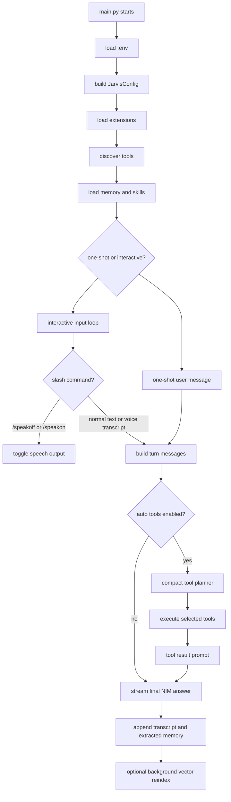

# Jarvis Architecture Report

This document is the architecture map for the Jarvis NIM Python assistant in this workspace. It explains what Jarvis is, how it boots, how it thinks, how tools get registered, how extensions/skills/memory/voice work, and where to add future capabilities without changing the core chat loop.

No secrets are documented here. API keys, OAuth tokens, generated audio, Telegram files, and memory indexes stay in ignored local files.

## What Jarvis Is

Jarvis is a local Python CLI assistant backed by NVIDIA NIM chat, tool-planning, memory, voice, and a manifest-driven tool system.

The core idea is:

- Keep the chat loop small.
- Put behavior instructions in prompt files.
- Put tools in JSON manifests.
- Put reusable work habits in `SKILL.txt` files.
- Put account/app configuration in JSON or `.env`.
- Let the model choose from registered tools instead of routing through hardcoded keyword logic.
- Ground current facts and local actions through tool results from the current turn.

Jarvis can run as:

- One-shot CLI: `python main.py --message "..."`.
- Interactive CLI: `python main.py`.
- Voice-enabled interactive CLI: press Space on an empty prompt to listen.
- Tool/debug CLI: `--list-tools`, `--list-extensions`, `--check-env`, `--check-voice`, `--list-mics`, `--voice-levels`, `--list-voices`.
- Telegram bot channel: `python telegram_bot.py`.

## High-Level Flow



## Main Runtime Files

| File | Role |
|---|---|
| `main.py` | CLI entrypoint, interactive loop, one-shot mode, voice commands, startup wiring. |
| `telegram_bot.py` | Telegram entrypoint that boots the same Jarvis config, registry, memory, extensions, skills, and `chat_once(...)`, then handles Telegram polling or webhook updates. |
| `jarvis_nim.py` | NVIDIA NIM client, streaming, tool-planner calls, tool execution flow, final response handling. |
| `extension_system.py` | Loads extension manifests from `extensions/*/extension.json`. |
| `tools/registry.py` | Converts tool JSON descriptors into executable Python tool objects. |
| `skill_system.py` | Loads `SKILL.txt` files from workspace and extension skill roots. |
| `memory_system.py` | Loads durable TXT memory, appends transcripts, extracts durable facts from chat. |
| `vector_memory.py` | Builds/searches NVIDIA embedding-backed vector memory index. |
| `voice_system.py` | STT, TTS, microphone input, speech output, speech sanitization, voice profiles. |

## Startup Sequence

`main.py` does the boot work in this order:

1. Configure stdout/stderr as UTF-8 with replacement fallback.
2. Load `.env` from the workspace root.
3. Parse CLI flags.
4. Load `VoiceConfig` for voice-related flags or interactive speech.
5. Build `JarvisConfig` from environment variables.
6. Load the extension catalog with `load_extension_catalog()`.
7. Discover all tools with `discover_tools(extension_catalog=...)`.
8. Load memory config and ensure memory files exist.
9. Route into `--list-tools`, `--list-extensions`, `--check-env`, one-shot mode, or interactive mode.

`telegram_bot.py` mirrors the shared startup path through config, extension catalog, tool discovery, and memory loading. After that shared boot, it loads `TelegramConfig` from env plus `config/telegram_bot.json`, starts polling or webhook mode, and registers one Telegram message handler.

In interactive mode:

1. Start a `VoiceSpeaker` if TTS is enabled.
2. Build long-lived base messages containing system prompt, persona, tool capability context, extension prompt context, skills, enabled extension status, and durable memory.
3. Read typed input or Space-triggered voice input.
4. Handle slash commands like `/speakoff` and `/speakon`.
5. Build a per-turn message list, optionally adding vector memory context for that user text.
6. Call `chat_once(...)`.
7. Print streamed answer and optionally speak it.
8. Append transcript and extract durable memory.

## Chat And Tool Pipeline

The main call path is:

```text
main.py -> chat_once(...) -> chat mode -> planner -> tools -> final answer
```

`JarvisConfig.tool_mode` controls the tool strategy:

- `json`: low-latency default. A compact planner model returns JSON tool calls, then Jarvis executes tools and asks the chat model to answer from grounded results.
- `native`: OpenAI-compatible native tool calls without streaming.
- `native_stream`: native streaming route for providers that handle many schemas fast.
- `hybrid`: native plus compact planner.

Current low-latency defaults are designed around:

- `NVIDIA_MODEL=mistralai/mistral-nemotron`
- `NVIDIA_TOOL_MODEL=mistralai/mistral-nemotron`
- `NVIDIA_TOOL_SELECTOR_MODEL=mistralai/mistral-nemotron`
- `NIM_STREAM_MODE=native`
- `NIM_TOOL_MODE=json`

The JSON path is intentionally compact. The selector sees manifest tool descriptors and can return a direct no-tool answer, complete tool calls, or a narrowed tool-name set for the planner. Tool results are always passed back through the final model so Jarvis writes the user-facing response from structured evidence instead of returning canned tool text.

## Prompt Stack

Jarvis behavior is not buried in the NIM client. It is assembled from files:

| Prompt File | Role |
|---|---|
| `prompts/chat_system.txt` | Main assistant behavior, grounding rules, current-fact rules, persona injection. |
| `prompts/persona.txt` | Jarvis persona/voice. |
| `prompts/tool_protocol.txt` | Planner-only protocol for deciding tool calls. |
| `prompts/tool_selector.txt` | Low-latency descriptor-first selector and direct no-tool answer policy. |
| `prompts/tool_results.txt` | Final-answer shaping from tool results. |
| `prompts/memory_context.txt` | Wraps durable memory chunks into system context. |
| `extensions/*/prompts/*.txt` | Extension-specific behavior, loaded into system context by the extension loader. |

The important split:

- `tool_protocol.txt` is for choosing tools only.
- `tool_selector.txt` is for quickly deciding direct answer, complete tool calls, or a narrowed tool subset.
- `tool_results.txt` is for converting grounded results into natural final answers.
- `chat_system.txt` is for ordinary assistant behavior and grounding boundaries.

## Tool Registration Architecture

Tools are registered from manifests, not from the chat loop.

There are two tool sources:

1. Core tools in `tools/tools.json`.
2. Extension tools in `extensions/*/extension.json`.

Each tool descriptor has this shape:

```json
{
  "name": "tool_name",
  "description": "What the tool does.",
  "parameters": {
    "type": "object",
    "properties": {},
    "required": [],
    "additionalProperties": false
  },
  "executor": {
    "module": "tools.some_module",
    "function": "some_function"
  }
}
```

Optional:

```json
{
  "sort_key": "zz_run_terminal",
  "planner_always_include": true
}
```

Command-backed tools can avoid new Python handler modules:

```json
{
  "name": "manifest_command_tool",
  "description": "Run an extension-owned script.",
  "parameters": {
    "type": "object",
    "properties": {},
    "additionalProperties": false
  },
  "executor": {
    "type": "command",
    "command": ["python", "{extension_root}/scripts/tool.py"],
    "cwd": "{workspace_root}",
    "stdin": "json",
    "output": "json",
    "timeout_seconds": 30
  }
}
```

`tools/registry.py` loads a descriptor by:

1. Reading JSON.
2. Validating `name`, `description`, `parameters`, and `executor`.
3. Loading either a Python executor or a command executor.
4. Registering the callable as a `Tool`.

Tool execution always returns a JSON payload:

```json
{
  "ok": true,
  "tool": "tool_name",
  "result": {}
}
```

On input or runtime errors:

```json
{
  "ok": false,
  "tool": "tool_name",
  "error": "message"
}
```

The model never calls Python functions directly. It asks for registered tool names and JSON parameters. The registry performs the execution.

## How To Add A Tool Without Touching Core

The standard process:

1. Prefer an extension-owned command tool when the task can be done by a script or terminal command.
2. Put the script under `extensions/<id>/scripts/`.
3. Register it in `extensions/<id>/extension.json` with `executor.type="command"`.
4. Add or edit a Python executor function only when the tool needs a reusable in-process API.
5. Add prompt guidance in an extension prompt when behavior matters.
6. Add a `SKILL.txt` if the model needs a reusable workflow.
7. Add config in `config/*.json` or env names in `.env.example`.
8. Add tests for discovery, direct executor behavior, and live Jarvis behavior when the tool affects user-facing output.

Do not edit `main.py` or `jarvis_nim.py` just to make a normal tool visible. The registry and extension loader already handle that.

## Extension System

Extensions live under:

```text
extensions/<extension-id>/extension.json
```

An extension can declare:

- `id`
- `name`
- `description`
- `tools`
- `prompt_files`
- `skill_dirs`
- `env`

`extension_system.py` loads every extension folder under `JARVIS_EXTENSIONS_DIR`, defaulting to `extensions`.

Control switches:

- `JARVIS_ENABLED_EXTENSIONS`: comma-separated allowlist. If set, only listed extension IDs load.
- `JARVIS_DISABLED_EXTENSIONS`: comma-separated denylist.

Extension prompt files are read and injected into the system context as:

```text
## Extension Name
prompt text...
```

Extension skill roots are added to the skill loader.

Current live extensions:

| Extension | Tools | Skill Roots | Purpose |
|---|---:|---:|---|
| `content-tools` | 2 | 1 | Text transformations and comparison. |
| `diagnostics` | 1 | 1 | Jarvis latency checks. |
| `memory-wiki` | 8 | 1 | TXT-backed knowledge vault. |
| `music-agent` | 7 | 1 | Local-first music library, playback, downloads, queue, and playlists. |
| `qa` | 1 | 1 | Jarvis QA/test runner. |
| `skill-workshop` | 1 | 1 | Create/read/update reusable skills. |
| `web` | 3 | 1 | Web search/fetch/readability tools. |
| `workspace` | 1 | 1 | Git/file/project inspection. |

## Skill System

Skills are plain text operational instructions in files named:

```text
SKILL.txt
```

The loader searches:

1. Workspace skill root, default `skills/`.
2. Every extension `skill_dirs` entry.

Skills can include optional frontmatter:

```text
---
name: skill-name
description: short description
---
Body instructions...
```

Loaded skills are bounded by `JARVIS_SKILL_CONTEXT_CHARS`, default `8000`, then injected into system context. This gives Jarvis reusable procedures without editing the chat loop.

## Memory System

Jarvis has three memory layers:

1. Durable text memory.
2. Extracted chat memory.
3. Optional vector memory.

Default memory root:

```text
memory/
```

Important files:

| Path | Purpose |
|---|---|
| `memory/user.txt` | Stable hand-written user facts and preferences. |
| `memory/extracted.txt` | Durable facts extracted from chat. |
| `memory/transcripts/YYYY-MM-DD.txt` | Raw conversation archive. |
| `memory/wiki/` | TXT/MD wiki pages managed by memory-wiki tools. |
| `memory/vector/index.json` | Cached vector memory index. |

`memory_system.py` ensures `user.txt` and `extracted.txt` exist. It loads bounded text chunks into a memory prompt. By default, transcripts are archived but not injected unless `MEMORY_INCLUDE_TRANSCRIPTS=true`.

After each chat turn, Jarvis:

1. Appends the exchange to the daily transcript.
2. Skips extraction for questions and disabled states.
3. Uses `NVIDIA_MEMORY_MODEL`, then `NVIDIA_TOOL_MODEL`, then the chat model to extract durable memory.
4. Appends extracted facts to `memory/extracted.txt`.
5. Optionally triggers background vector reindex.

## Vector Memory

Vector memory uses NVIDIA NIM embeddings.

Default embedding model:

```text
nvidia/nv-embedqa-e5-v5
```

Files are chunked from memory TXT/MD files and cached in:

```text
memory/vector/index.json
```

Main controls:

| Env | Purpose |
|---|---|
| `MEMORY_VECTOR_ACTIVE` | If true, existing vector matches are injected into normal turns. Default false for latency. |
| `MEMORY_VECTOR_BACKGROUND_REINDEX` | If true, memory extraction can trigger background reindex. |
| `MEMORY_VECTOR_QUERY_TIMEOUT_SECONDS` | Keeps semantic recall from hurting latency. |
| `MEMORY_VECTOR_TOP_K` | Match count. |
| `MEMORY_VECTOR_CONTEXT_CHARS` | Max injected context size. |

Vector memory is also exposed as tools:

- `memory_vector_status`
- `memory_vector_reindex`
- `memory_vector_search`

## Voice System

Voice lives in `voice_system.py` and is controlled by env plus `config/voice_profiles.json`.

Modes:

- STT: Space on an empty prompt records one utterance.
- TTS: assistant replies can be spoken in the background.
- Voice test flags: `--check-voice`, `--list-mics`, `--voice-levels`, `--list-voices`, `--voice-say`, `--voice-roundtrip`, `--voice-listen-test`.

Interactive speech commands:

```text
/speakoff
/speakon
```

`/speakoff` stops spoken replies without disabling typed chat or text streaming. `/speakon` turns speech back on when TTS is available.

Anti-feedback behavior:

- If Space is pressed while Jarvis is still speaking, the listener waits for the speaker to become idle.
- A short cooldown runs after speech output before microphone capture.

Speech text is sanitized before TTS:

- Removes Markdown noise.
- Drops timing lines.
- Replaces paths/URLs with natural speech words like `local file` or `link`.
- Splits long replies into bounded chunks.
- Avoids NVIDIA TTS oversized sentence failures.

## Current Tool Inventory

### Core Grounding And Utility

- `calculate`
- `get_current_datetime`
- `get_weather`
- `get_system_info`
- `get_pc_status`
- `get_runtime_info`
- `run_terminal`
- `list_registered_tools`

### Filesystem And Workspace

- `list_directory`
- `read_text_file`
- `get_file_info`
- `search_text_files`
- `workspace_inspect`

### Text And Content

- `text_stats`
- `hash_text`
- `generate_uuid`
- `transform_text`
- `compare_text`
- `document_extract_text`

### Web

- `web_search`
- `fetch_url_text`
- `extract_url_content`

### Memory And Wiki

- `wiki_status`
- `wiki_search`
- `wiki_get`
- `wiki_apply`
- `wiki_lint`
- `memory_vector_status`
- `memory_vector_reindex`
- `memory_vector_search`

### Music Agent

- `music_status`
- `music_search`
- `music_download`
- `music_play`
- `music_control`
- `music_playlist`
- `music_library`

### QA And Diagnostics

- `run_jarvis_qa`
- `jarvis_latency_probe`
- `skill_workshop`

## Agent Extensions

### Music Agent

Files:

- `extensions/music-agent/extension.json`
- `extensions/music-agent/prompts/music-agent.txt`
- `extensions/music-agent/skills/music-operator/SKILL.txt`
- `tools/music_agent.py`
- `config/music_agent.json`

Capabilities:

- Search local files first by title, artist, album, filename, and close spelling match.
- Download missing songs through the configured downloader only when no local match exists.
- Store local track metadata and paths in a JSON music database.
- Play songs and playlists through the configured player or OS media opener.
- Maintain queue, repeat, shuffle, favorites, and recent history.

### Telegram Bot

Files:

- `telegram_bot.py`
- `extensions/telegram-bot/extension.json`
- `tools/telegram_bot_tools.py`
- `config/telegram_bot.json`

Capabilities:

- Run Jarvis as a Telegram polling or webhook bot without wrapping the CLI loop.
- Persist one chat-compatible session JSON per Telegram chat.
- Accept text, document, photo, audio, and voice-note inputs.
- Queue and send local files to the current Telegram chat through runtime-only Telegram helper tools.
- Keep chat work non-blocking by running the synchronous `chat_once(...)` call in a thread executor.

### Memory Wiki

Files:

- `extensions/memory-wiki/extension.json`
- `tools/memory_wiki.py`
- `memory/wiki/`

Capabilities:

- Show wiki status.
- Exact search wiki/durable memory.
- Read pages.
- Create/update pages.
- Lint pages for metadata.

### Skill Workshop

Files:

- `extensions/skill-workshop/extension.json`
- `tools/skill_workshop.py`
- `skills/`

Capabilities:

- Create reusable `SKILL.txt` workflows.
- Queue changes.
- Inspect/read skills.
- Approve/reject skill updates.

### QA And Diagnostics

QA tools run unit tests or live Jarvis verification. Diagnostics include latency probes so speed issues can be measured through the same assistant surface.

## Grounding Rules

Jarvis is designed to avoid false claims:

- Current date/time must come from `get_current_datetime`.
- Weather must come from `get_weather`.
- Local files/folders/system/version/app launches must come from tools.
- Current web and "latest" claims must come from current-turn web tools.
- Memory is background context only, not evidence for current state.
- Tool work is invisible to the user unless they ask for internals.
- Final answers are generated from current-turn tool results.

The tool result prompt explicitly tells the model:

- The original user request is intent, not proof.
- Tool fields decide what actually happened.
- `action_completed=false` means no external state change.
- Tool result text fields are supporting evidence, not final canned responses.
- Status/readiness/list/read/date/weather/search results should not get generic "No external action happened" text unless the tool result says so.

## Security And Local State

Ignored local files include:

- `.env`
- `media/`
- `memory/*.txt`
- `memory/transcripts/*.txt`
- `memory/wiki/`
- `memory/vector/`
- `memory/research/dossiers/`
- `memory/research/cache/`
- `memory/research/watchlists.json`
- `memory/research/runs.jsonl`
- `client_secret_*.json`
- benchmark/result JSON files

Important private locations:

| Path | Content |
|---|---|
| `.env` | Local API keys and account env vars. |
| `media/telegram/` | Telegram sessions, uploads, downloads, outbox files, and optional per-user memory. |

Docs and reports should never include raw secrets.

## Configuration Map

### Core NIM

- `NVIDIA_API_KEY`
- `NVIDIA_BASE_URL`
- `NVIDIA_MODEL`
- `NVIDIA_TOOL_MODEL`
- `NVIDIA_MEMORY_MODEL`
- `NVIDIA_EMBEDDING_MODEL`
- `NVIDIA_STREAM`
- `NIM_STREAM_MODE`
- `NIM_TOOL_MODE`
- `NIM_PARALLEL_TOOL_CALLS`
- `NIM_NATIVE_PLANNER_CONFIRM`
- `NIM_NATIVE_VERIFY_NO_TOOL`

### Tools And Extensions

- `JARVIS_AUTO_TOOLS`
- `JARVIS_EXTENSIONS_DIR`
- `JARVIS_ENABLED_EXTENSIONS`
- `JARVIS_DISABLED_EXTENSIONS`
- `JARVIS_SKILLS_DIR`
- `JARVIS_SKILL_CONTEXT_CHARS`
- `JARVIS_PATH_ALIASES_CONFIG`
- `JARVIS_LIST_DIRECTORY_LIMIT`
- `JARVIS_WEB_SEARCH_URL`

### Telegram

- `JARVIS_TELEGRAM_CONFIG`
- `TELEGRAM_BOT_TOKEN`
- `TELEGRAM_ALLOWED_CHATS`
- `TELEGRAM_WEBHOOK_URL`

### Voice

- `VOICE_ENABLED`
- `VOICE_SPACE_TRIGGER`
- `STT_ENABLED`
- `STT_PROVIDER`
- `STT_NVIDIA_SERVER`
- `STT_NVIDIA_FUNCTION_ID`
- `TTS_ENABLED`
- `TTS_PROVIDER`
- `TTS_NVIDIA_SERVER`
- `TTS_NVIDIA_FUNCTION_ID`
- `JARVIS_VOICE_PROFILE_FILE`
- `JARVIS_VOICE_PROFILE`

## Testing Strategy

The test suite lives in `tests/` and is run with:

```powershell
python -m unittest discover
```

The current suite covers:

- Tool discovery.
- Tool manifest registration.
- Parser behavior.
- Terminal/background behavior.
- Filesystem aliases.
- Memory and vector memory helpers.
- Voice config, TTS sanitization, speech chunks, STT parsing.
- `/speakoff` and `/speakon`.
- Streaming and native tool parser paths.
- Telegram config, session pruning, response chunking, context-local helper functions, and file outbox delivery.

Live behavior checks use:

```powershell
python scripts\verify_jarvis_live.py
python main.py --list-tools
python main.py --list-extensions
python main.py --message "..."
```

For user-facing behavior, live Jarvis CLI checks matter because unit tests alone can miss final-response issues.

## Current Known Limits

- Vector memory is off by default for normal chat to protect latency.
- Voice depends on NVIDIA Riva/NVCF function IDs and local audio packages.
- Telegram voice-note transcription also depends on a working audio converter such as ffmpeg.

## Upgrade Pattern

For any future agent or capability:

1. Create an extension folder under `extensions/<agent-id>/`.
2. Add `extension.json` with tools, prompt files, skill dirs, and env names.
3. Put behavior guidance in `prompts/<agent>.txt`.
4. Put reusable operating procedure in `skills/<skill-name>/SKILL.txt`.
5. Implement executor functions in `tools/<agent>.py`.
6. Store agent settings in `config/<agent>.json`.
7. Keep generated/account/session state under ignored `media/` or `memory/`.
8. Add tests for direct tool behavior, manifest discovery, and real Jarvis-facing output.

The core chat loop should only change for cross-cutting runtime features such as streaming, interactive input, speech toggles, or memory injection. Normal tools and agents should ride through manifests and prompts.
