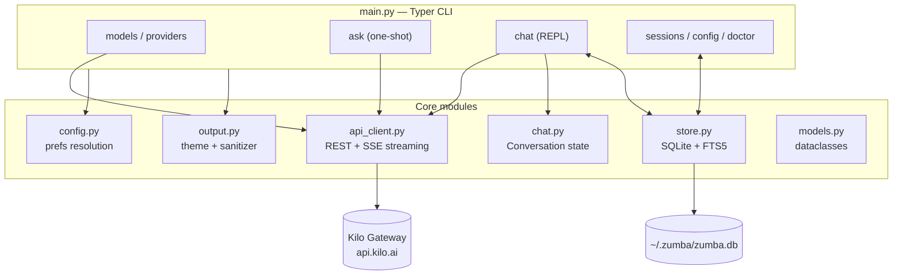
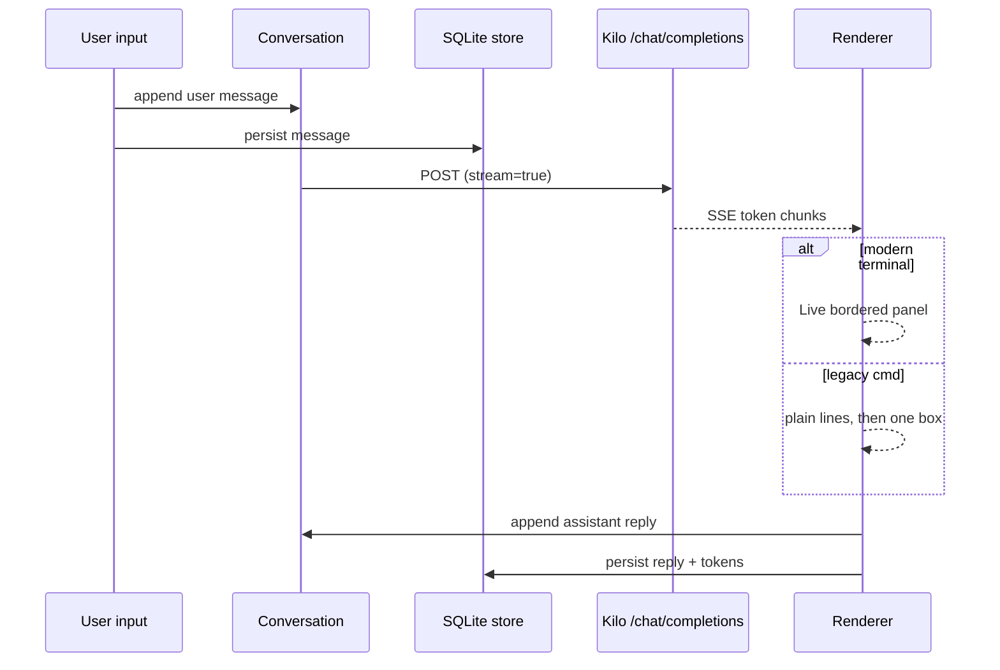
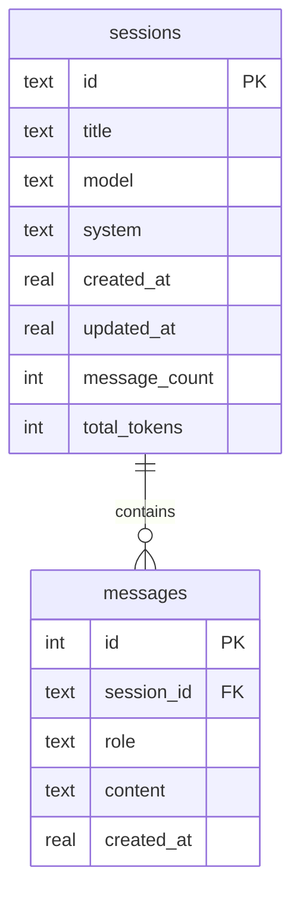

# ZUMBA — Personal AI Assistant

Zumba is a Python CLI personal assistant powered by the [Kilo AI Gateway](https://kilo.ai/docs/gateway) — one OpenAI-compatible endpoint for hundreds of models, including free ones. It features an interactive chat REPL, persistent SQLite-backed sessions, streaming responses, and a terminal-aware renderer that stays clean on both modern terminals and legacy Windows `cmd`.

## Features

- **Free-first** — defaults to `kilo-auto/free`; `zumba models` lists all 18+ free models with no API key needed
- **Interactive chat** — REPL with streaming answers inside bordered panels, slash commands, per-turn autosave
- **Resume that feels continuous** — `--resume` / `--last` / `/load <#>` reprints previous messages before continuing
- **Numbered session picker** — Codex-style `/sessions` list; type a number instead of a 12-char id
- **Persistent preferences** — `/model <id>` saves the global default; system prompt, streaming, and emoji prefs survive restarts
- **Full-text session search** — FTS5 over all messages (`zumba sessions --search <text>`)
- **Legacy-cmd safe rendering** — auto-detects conhost vs Windows Terminal/VS Code; strips emojis, folds smart punctuation, repairs old mojibake
- **18+ passing tests** — mocked API, storage, and renderer tests

## Requirements

- Python 3.11+
- A Kilo API key for chatting (`KILO_API_KEY`) — free models still need a key; listing models does not

## Setup

```powershell
cd zumba
pip install -r requirements.txt
copy .env.example .env   # then put your key in .env
```

| Variable            | Purpose                              | Default                              |
| ------------------- | ------------------------------------ | ------------------------------------ |
| `KILO_API_KEY`      | Auth for chat endpoints (required)   | —                                    |
| `KILO_BASE_URL`     | Gateway override                     | `https://api.kilo.ai/api/gateway`    |
| `ZUMBA_MODEL`       | Env-level default model (top priority)| `kilo-auto/free`                    |
| `ZUMBA_NO_EMOJI`    | Force emoji stripping (`1`)          | auto-detect                          |
| `ZUMBA_FORCE_EMOJI` | Force full unicode (`1`)             | auto-detect                          |

Model precedence: `--model` flag → `ZUMBA_MODEL` env → saved default → `kilo-auto/free`.

## Usage

```powershell
python main.py models                 # list free models (no key needed)
python main.py models --all           # list all ~369 models
python main.py models --set-default cohere/north-mini-code:free
python main.py ask "Explain black holes briefly"
python main.py chat                   # start interactive chat
python main.py chat --last            # continue most recent session
python main.py chat --resume 2        # continue session #2
python main.py sessions               # list saved chats
python main.py sessions --search "invoice"
python main.py sessions --show 1      # print full transcript
python main.py config                 # view preferences
python main.py config --set-model <id> --set-streaming off
python main.py doctor                 # terminal/rendering diagnostics
python main.py version
```

### In-chat commands

| Command        | Action                                        |
| -------------- | --------------------------------------------- |
| `/help`        | Command table                                 |
| `/models`      | Free-model table                              |
| `/model <id>`  | Switch model **and save as default**          |
| `/sessions`    | Numbered picker → type a number to load       |
| `/load <#>`    | Load session by number (bare `/load` picks)   |
| `/new`         | Start a fresh session                         |
| `/system`      | Update system prompt                          |
| `/stream`      | Toggle streaming                              |
| `/emoji`       | Toggle emoji stripping                        |
| `/tokens`      | Token estimate                                |
| `/clear`       | Clear history                                 |
| `/exit`        | Save and exit (Ctrl+C also saves)             |

## Architecture



### Request flow (chat turn)



### Storage layout (like Hermes/OpenClaw)



- Home store: `~/.zumba/zumba.db` (WAL mode), `~/.zumba/models_cache.json`
- Legacy `sessions/*.json` files auto-import once on first run
- Preferences live in the `config` table: `default_model`, `default_system`, `streaming`, `last_session`

## Project structure

```text
zumba/
├── main.py          # Typer CLI: models / ask / chat / sessions / config / doctor
├── api_client.py    # Gateway client: list_models, chat_completion, SSE streaming
├── chat.py          # Conversation state, save/load, token estimates
├── store.py         # SQLite sessions + FTS search + config prefs
├── config.py        # Env + saved + default resolution
├── output.py        # Theme, tables/panels, emoji + mojibake sanitizer
├── models.py        # Message / ModelInfo / ChatResult dataclasses
├── sessions/        # Legacy JSON sessions (auto-migrated, git-ignored)
├── tests/           # pytest suite (API mocks, storage, renderer)
├── requirements.txt
└── .env.example
```

## Terminal support

| Terminal                        | Emoji | Box style | Streaming       |
| ------------------------------- | ----- | --------- | --------------- |
| Windows Terminal / VS Code      | Full  | Rounded   | Live boxed panel|
| Legacy `cmd` / conhost          | Stripped (auto) | ASCII | Plain + final box |

`zumba doctor` diagnoses the current terminal and prints fixes.

## Testing

```powershell
python -m pytest tests -q
```

## Troubleshooting

| Symptom | Fix |
| ------- | --- |
| `KILO_API_KEY is not set` | `setx KILO_API_KEY "key"` or add to `.env` |
| `401` | Invalid key — regenerate at kilo.ai |
| `402` | Out of credits — free models (`:free`) don't bill |
| Boxes/garbled text in cmd | Expected — safe mode is on; use Windows Terminal or `zumba doctor` |
| Empty assistant reply | Transient provider hiccup — retry or `/model kilo-auto/free` |
