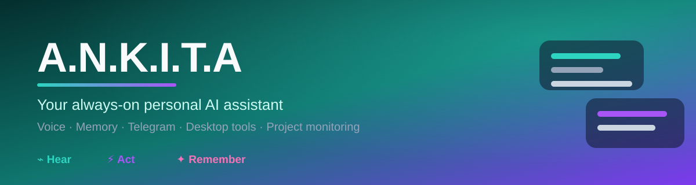

<div align="center">

<p>
  
</p>

### A Python personal AI assistant with voice, memory, Telegram, desktop tools, and always-on project monitoring

**Hear. Act. Remember. — your AI teammate that stays with you across every surface.**

[](#installation)
[](#license)
[](https://github.com/akyourowngames/A.N.K.I.T.A/stargazers)
[](https://github.com/akyourowngames/A.N.K.I.T.A/issues)
[](https://github.com/akyourowngames/A.N.K.I.T.A/commits/feature/openclaw-style-telegram-runtime)
[](#runtime--gateways)
[](#configuration)

<p>
  <a href="#-why-a-n-k-i-t-a">Why A.N.K.I.T.A</a> ·
  <a href="#-live-demo">Live Demo</a> ·
  <a href="#-highlights">Highlights</a> ·
  <a href="#-installation">Installation</a> ·
  <a href="#-configuration">Configuration</a> ·
  <a href="#-whats-inside">What's Inside</a> ·
  <a href="#-support--feedback">Support</a>
</p>

</div>

---

## 🤖 Why A.N.K.I.T.A?

> **A personal AI that doesn't just chat — it operates your machine, remembers what matters, and keeps watch on your projects.**

A.N.K.I.T.A is a **local-first personal AI assistant** built in Python. It combines a multi-agent core, persistent memory, speech I/O, a Telegram surface, desktop/computer tools, and proactive project monitoring — all driven by the LLM provider you choose (NVIDIA NIM, Groq, or GitHub Copilot).

**The three pillars:**

- 🎧 **Hear** — voice input, speech-to-text, and natural conversation across terminal, GUI, and Telegram.
- ⚡ **Act** — a tool plane that opens apps, moves files, runs code, controls the desktop, and automates workflows.
- ✦ **Remember** — a memory system that stores facts, conversations, and learned patterns so it gets smarter over time.

---

## 🎬 Live Demo

<p align="center">
  
</p>
<p align="center"><sub>See A.N.K.I.T.A in action — voice, tools, and proactive assistance.</sub></p>

---

## ⚡ Highlights

| | | |
|---|---|---|
| 🎙️ **Voice & speech** | 🧠 **Persistent memory** | 🤖 **Multi-agent core** |
| Speech-to-text, voice replies, and natural conversation. | Facts, conversations, and behavioral patterns that compound over time. | Specialized agents (code, web, image, file, music, navigator…) orchestrated by a supervisor. |
| 💬 **Telegram bot** | 🖥️ **Desktop tools** | 🔭 **Always-on monitoring** |
| Chat with your assistant from anywhere via Telegram. | Open apps, manage files, run commands, control the GUI. | Proactive project monitoring that surfaces what changed. |
| 👁️ **Vision** | 🗺️ **Maps & location** | 🔌 **Pluggable LLMs** |
| Screenshot/webcam analysis with a vision model. | OSM or Google Maps provider for location-aware help. | NVIDIA NIM, Groq, or GitHub Copilot — swap without code changes. |

---

## 🏁 Installation

```bash
git clone https://github.com/akyourowngames/A.N.K.I.T.A.git
cd A.N.K.I.T.A
python -m venv .venv
.\.venv\Scripts\Activate.ps1        # Windows PowerShell
# source .venv/bin/activate         # macOS / Linux
pip install -r requirements.txt     # dependencies (or: pip install -e .)
```

> 📦 If a `requirements.txt` isn't present in your checkout, install from the project's packaging file or add the deps you need — the runtime only requires the LLM SDKs you configure.

---

## ⚙️ Configuration

Copy the example env file and fill in at least one provider's keys:

```bash
cp .env.example .env
```

`.env.example` supports:

| Setting | Meaning |
|---|---|
| `LLM_PROVIDER` | `nvidia` · `groq` · `copilot` |
| `NVIDIA_API_KEY` / `GROQ_API_KEY` / `COPILOT_GITHUB_TOKEN` | Provider credentials |
| `VISION_PROVIDER` / `VISION_MODEL` | Vision model for screenshots/webcam (e.g. `meta/llama-3.2-11b-vision-instruct`) |
| `GATEWAY_MODE` | `telegram` · `gui` · `gui+telegram` |
| `MAPS_PROVIDER` | `osm` (default) · `google` |
| `*_MODEL` / `*_CODE_MODEL` | Per-task model overrides (chat, reasoning, supervisor, coding) |

---

## 🚀 Runtime / Gateways

A.N.K.I.T.A can run in several surfaces, controlled by `GATEWAY_MODE`:

```bash
python gateway.py            # respects GATEWAY_MODE (telegram / gui / gui+telegram)
python chat.py              # terminal chat
python gui.py               # desktop GUI
python telegram_bot.py      # Telegram-only bot
```

Pick the surface that fits — same memory, same tools, same assistant.

---

## 🧩 What's Inside

| Area | What lives there |
|---|---|
| `agents/` | Orchestrator, planner, supervisor, and specialist agents (code, web, image, file, music, navigator, report, screen, terminal…) with prompt packs in `agents/prompts/`. |
| `llm/` | `LLMRuntime`, provider client, and an `agent_router` that picks the right model per task. |
| `memory/` | `manager`, `fact_store`, `vector_store`, and `summarizer` — the persistent brain. |
| `tools/` | The tool plane (file ops, desktop control, web, code execution, integrations). |
| `proactive.py` | Always-on project monitoring and anticipatory actions. |
| `telegram_bot.py` / `gui.py` / `chat.py` / `gateway.py` | Entry points and surfaces. |

---

## 🤝 Contributing

Small PRs are welcome — especially:

- A clearer `requirements.txt` / packaging setup
- More agent prompt packs
- Extra gateway surfaces or integrations
- Docs, demos, and tests

Open an [issue](https://github.com/akyourowngames/A.N.K.I.T.A/issues) or start a [discussion](https://github.com/akyourowngames/A.N.K.I.T.A/discussions) first if it's a big change.

---

## 📈 Star History

[](https://www.star-history.com/#akyourowngames/A.N.K.I.T.A&Date)

If A.N.K.I.T.A helps you, a ⭐ is the easiest way to help others find it.

---

## 💬 Support & Feedback

- **Bug or idea?** [Open an issue](https://github.com/akyourowngames/A.N.K.I.T.A/issues).
- **Questions?** Start a [discussion](https://github.com/akyourowngames/A.N.K.I.T.A/discussions).
- **Built something cool on top?** Drop a link in an issue — I'd love to see it.

> Made with ☕ and curiosity by [@akyourowngames](https://github.com/akyourowngames). Always learning.

---

## 🔗 More from the same author

- [friday](https://github.com/akyourowngames/friday) — local-first AI assistant (graph memory, semantic routing, FastAPI/Next.js).
- [AniKai](https://github.com/akyourowngames/AniKai) — anime discovery web app (Next.js + Vercel).
- [echo89](https://github.com/akyourowngames/echo89) — local-first cinematic music player.

---

## License

Released under the [MIT License](https://opensource.org/licenses/MIT).
