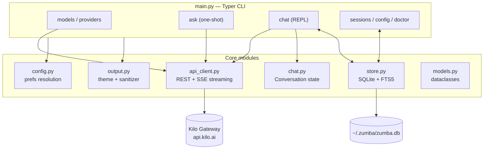
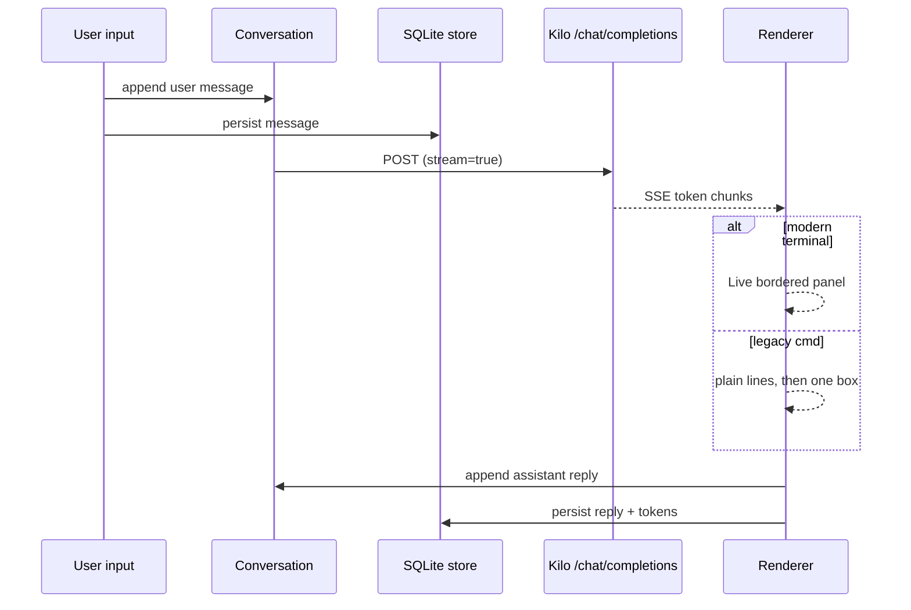
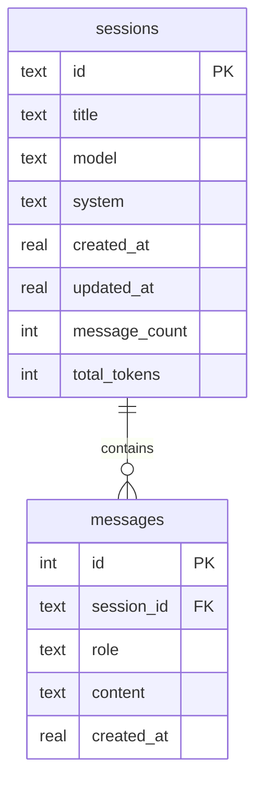

# ZUMBA — Personal AI Assistant

Zumba is a Python CLI personal assistant powered by the [Kilo AI Gateway](https://kilo.ai/docs/gateway) — one OpenAI-compatible endpoint for hundreds of models, including free ones. It features an interactive chat REPL, persistent SQLite-backed sessions, streaming responses, a terminal-aware renderer, and a **long-term memory system** built on a temporal knowledge graph (GraphRAG-style).

## Memory (the hippocampus)

Zumba has a built-in long-term memory system — a temporal knowledge graph stored in a single embedded SQLite database (`~/.zumba/memory.db`, zero servers, works offline). Design synthesized from the GraphRAG / LightRAG / Zep-Graphiti / Mem0 / HippoRAG / MemGPT lines of research:

### Write path (after every chat turn)
1. **Capture** — the exchange is stored as an episode (content-hashed, dedup-safe).
2. **Salience gate** — the LLM decides whether the exchange is worth remembering (chit-chat is kept as searchable history but not distilled).
3. **Extraction** — the LLM extracts entities, typed relations and facts with confidence scores.
4. **Entity resolution** — alias table + vector similarity + LLM merge decisions map mentions onto canonical entities.
5. **Write decision** — Mem0-style ADD / UPDATE / NOOP / INVALIDATE against existing facts; contradictions *invalidate* (bi-temporal `valid_at`/`invalid_at`) instead of deleting, so history is never lost.
6. **Auto-linking** — A-Mem-style notes are embedded and linked to related notes.

### Read path (before every chat turn)
Hybrid recall with **no LLM in the loop**: vector KNN (local ONNX embeddings, bge-small, 384-dim) + BM25 full-text + graph expansion via **Personalized PageRank** seeded by matched entities, fused with reciprocal-rank fusion and packed into a token budget with provenance. The block is injected as a system message just before your turn (never saved into session history).

### Sleep-time consolidation
Runs opportunistically in the background (or via `zumba memory consolidate`): exponential decay + reinforcement of entity salience, note-link recharging, **Leiden community detection** with LLM-written cluster summaries (GraphRAG global memory), and a **core-block rewrite** (MemGPT/Letta-style L1 profile blocks).

### CLI

```powershell
python main.py memory stats            # graph counts + db location
python main.py memory search "..."     # hybrid recall (vector + BM25 + PPR)
python main.py memory add "..."        # store a fact through the full pipeline
python main.py memory forget <name>    # invalidate facts about an entity
python main.py memory consolidate      # run sleep-time compute now
python main.py memory clear --yes      # wipe all memory
```

### In-chat commands

| Command         | Action                                   |
| --------------- | ---------------------------------------- |
| `/remember <t>` | Store a fact in long-term memory         |
| `/memory <q>`   | Search long-term memory                  |
| `/forget <n>`   | Invalidate facts about an entity         |

Set `ZUMBA_NO_MEMORY=1` to disable memory entirely; every memory failure degrades gracefully — chat never breaks because of it.

## Features (chat + sessions)

- **Long-term memory (the hippocampus)** — every exchange is salience-gated and, when memorable, distilled by the LLM into entities, temporal relations and linked notes stored in an embedded knowledge graph. Recall fuses vector search, full-text (BM25) and Personalized PageRank over the graph, and is injected into your prompts automatically.
- **MCP tool servers** — Model Context Protocol layer (`mcpclient/`): stdio/HTTP/SSE servers from `~/.zumba/mcp.json`, OpenAI-style tool loop (25 max turns, final summarize so long runs never end in `(empty response)`), tool transcript persisted across turns in memory (last 10) and in the session DB so `continue`/`--resume` keep tool context (folded into a digest, never replayed bare), live reload + self-install meta-tools
- **429 resilience** — gateway client retries once after `Retry-After` (also one retry on transient 502/503); agent loop retries flaky model calls and ends the turn with a progress summary instead of an error when the provider stays down; memory consolidation throttled (no full run on start, 30-min interval) so background LLM calls don't self-inflict rate limits
- **Free-first** — defaults to `kilo-auto/free`; `zumba models` lists all 18+ free models with no API key needed
- **Interactive chat** — REPL with streaming answers inside bordered panels, slash commands, per-turn autosave
- **Resume that feels continuous** — `--resume` / `--last` / `/load <#>` reprints previous messages before continuing
- **Numbered session picker** — Codex-style `/sessions` list; type a number instead of a 12-char id
- **Persistent preferences** — `/model <id>` saves the global default; system prompt, streaming, and emoji prefs survive restarts
- **Full-text session search** — FTS5 over all messages (`zumba sessions --search <text>`)
- **Legacy-cmd safe rendering** — auto-detects conhost vs Windows Terminal/VS Code; strips emojis, folds smart punctuation, repairs old mojibake
- **Graceful shutdown** — Ctrl+C during save/flush or MCP teardown exits cleanly with session saved
- **God-mode shell** — unrestricted persistent PowerShell for the model (`zumba__shell_run/jobs/kill`) and you (`/shell`, `python main.py shell`); background jobs, audit log, `ZUMBA_NO_SHELL=1` kill-switch
- **Context window manager** — every model call fits `ZUMBA_CONTEXT_LIMIT` (default 8192): system + anchor + recent turns kept, middle overflow becomes one cached rolling summary, stale tool transcripts truncated
- **Persona + provenance** — identity voice with editable `style` prefs (`zumba config --set-style`); `/why` explains the last turn's memory recall with kinds and scores
- **101 passing tests** — mocked API, storage, renderer, memory-graph, MCP agent/manager, shell, context-budget, persona, why, and tool-memory tests

## Requirements

- Python 3.11+
- A Kilo API key for chatting (`KILO_API_KEY`) — free models still need a key; listing models does not

## Setup

```powershell
cd zumba
pip install -r requirements.txt
copy .env.example .env   # then put your key in .env
```

| Variable            | Purpose                              | Default                              |
| ------------------- | ------------------------------------ | ------------------------------------ |
| `KILO_API_KEY`      | Auth for chat endpoints (required)   | —                                    |
| `KILO_BASE_URL`     | Gateway override                     | `https://api.kilo.ai/api/gateway`    |
| `ZUMBA_MODEL`       | Env-level default model (top priority)| `kilo-auto/free`                    |
| `ZUMBA_NO_EMOJI`    | Force emoji stripping (`1`)          | auto-detect                          |
| `ZUMBA_FORCE_EMOJI` | Force full unicode (`1`)             | auto-detect                          |
| `ZUMBA_NO_MCP`      | Disable MCP layer entirely (`1`)     | enabled                              |
| `ZUMBA_MCP_MAX_ITERATIONS` | Max tool turns per chat turn  | `25`                                 |
| `ZUMBA_NO_SHELL`    | Disable god-mode shell (`1`)         | enabled                              |
| `ZUMBA_SHELL_TIMEOUT` | Default shell timeout (seconds)    | `60`                                 |
| `ZUMBA_SHELL_MAX_OUTPUT` | Shell output cap (chars, head+tail) | `8000`                            |
| `ZUMBA_CONTEXT_LIMIT` | Context budget per model call      | `8192`                               |
| `ZUMBA_NO_MEMORY`   | Disable long-term memory (`1`)       | enabled                              |

Model precedence: `--model` flag → `ZUMBA_MODEL` env → saved default → `kilo-auto/free`.

## Usage

```powershell
python main.py models                 # list free models (no key needed)
python main.py models --all           # list all ~369 models
python main.py models --set-default cohere/north-mini-code:free
python main.py ask "Explain black holes briefly"
python main.py chat                   # start interactive chat
python main.py chat --last            # continue most recent session
python main.py chat --resume 2        # continue session #2
python main.py sessions               # list saved chats
python main.py sessions --search "invoice"
python main.py sessions --show 1      # print full transcript
python main.py config                 # view preferences
python main.py config --set-model <id> --set-streaming off
python main.py doctor                 # terminal/rendering diagnostics
python main.py version
```

### In-chat commands

| Command        | Action                                        |
| -------------- | --------------------------------------------- |
| `/help`        | Command table                                 |
| `/models`      | Free-model table                              |
| `/model <id>`  | Switch model **and save as default**          |
| `/sessions`    | Numbered picker → type a number to load       |
| `/load <#>`    | Load session by number (bare `/load` picks)   |
| `/new`         | Start a fresh session                         |
| `/system`      | Update system prompt                          |
| `/stream`      | Toggle streaming                              |
| `/emoji`       | Toggle emoji stripping                        |
| `/tokens`      | Token estimate                                |
| `/shell <cmd>` | Run a shell command directly (god-mode, persistent) |
| `/why`         | Explain the last turn's memory recall         |
| `/clear`       | Clear history                                 |
| `/exit`        | Save and exit (Ctrl+C also saves)             |

## Architecture



### Request flow (chat turn)



### Storage layout (like Hermes/OpenClaw)



- Home store: `~/.zumba/zumba.db` (WAL mode), `~/.zumba/models_cache.json`
- Legacy `sessions/*.json` files auto-import once on first run
- Preferences live in the `config` table: `default_model`, `default_system`, `streaming`, `last_session`

## MCP — plug in any tool server

ZUMBA speaks the [Model Context Protocol](https://modelcontextprotocol.io). Register any MCP server (stdio subprocess, streamable HTTP or SSE) and ZUMBA connects to it, exposes its tools to the model, and runs a full agent loop: the model asks for a tool → ZUMBA executes it over MCP → the result goes back to the model → repeat until the final answer.

```powershell
python main.py mcp list                              # connected servers + live status
python main.py mcp add fs -- npx -y @modelcontextprotocol/server-filesystem C:/Users/anime
python main.py mcp add remote --url https://mcp.example.com/mcp
python main.py mcp remove fs
python main.py mcp tools                             # every tool, namespaced server__tool
python main.py mcp call demo__add -a '{"a": 2, "b": 3}'   # call any tool directly, no LLM
```

Servers live in `~/.zumba/mcp.json` (Claude-Desktop compatible format — copy configs straight over) with project-level overrides in `.mcp.json` (see `mcp.json.example`). In chat: `/mcp` shows server status, `/tools` lists all tools, and when a server is online every turn automatically runs the agent loop. `ZUMBA_NO_MCP=1` disables the layer; a crashing/offline server degrades gracefully exactly like memory. A working example server is bundled: `zumba mcp add demo -- python tests/mcp_echo_server.py`.

### Live reload & self-installation

Changes apply **in the current session — no restart**:
- `python main.py mcp reload` (or `/mcp reload` in chat) hot-reloads the registry: new servers connect, removed ones shut down, changed ones reconnect.
- Editing `~/.zumba/mcp.json` while chatting is picked up automatically on the next message.
- ZUMBA can **manage itself**: the model gets built-in meta-tools (`zumba__mcp_search`, `zumba__mcp_add`, `zumba__mcp_remove`, `zumba__mcp_list`) backed by the official MCP registry. Just ask *"find and install an MCP server for GitHub"* and ZUMBA searches the registry, installs, connects, and uses it — all mid-session.

## Shell — god-mode command tool

Unrestricted, persistent PowerShell for the model and you. One long-lived session: cwd, env vars, and files carry over between calls, so the model chains state instead of re-stating it. No allowlists, no approval prompts — every command, exit code, and timestamp is appended to `~/.zumba/shell_audit.log`.

```powershell
python main.py shell "python --version"   # one-shot (exit code propagates)
```

In chat: `/shell <cmd>` runs directly (bypasses the model); the model gets `zumba__shell_run` (+ `shell_jobs` / `shell_kill` for background jobs with `run_in_background: true`). Timeouts return partial output and restart the session; output caps at `ZUMBA_SHELL_MAX_OUTPUT` (head+tail); `ZUMBA_NO_SHELL=1` removes the tools.

## Context, persona, provenance

- Every model call is fit to `ZUMBA_CONTEXT_LIMIT` (default 8192) by `context_budget.py`: system prompts, the first user message (session anchor), and recent turns are always kept; dropped middle turns become one cached rolling summary (rebuilt after ≥6 newly dropped turns); stale tool transcripts truncate to 200 chars.
- `persona.py` gives Zumba its voice (direct, warm, zero fluff) with editable style prefs (`zumba config --set-style "..."`); `--system` still overrides everything.
- `/why` shows the last turn's exact memory injection: recall query, hit kinds, scores, and source ids. `/why off|on` toggles capture (default on, zero extra cost).


## Project structure

```text
zumba/
├── main.py          # Typer CLI: models / ask / chat / sessions / config / memory / mcp / shell / doctor
├── api_client.py    # Gateway client: list_models, chat_completion (+tools), SSE streaming
├── chat.py          # Conversation state, save/load, token estimates
├── store.py         # SQLite sessions + FTS search + config prefs
├── config.py        # Env + saved + default resolution
├── output.py        # Theme, tables/panels, emoji + mojibake sanitizer
├── models.py        # Message (incl. tool_calls) / ModelInfo / ChatResult dataclasses
├── shelltool.py     # God-mode persistent PowerShell session + background jobs + audit
├── context_budget.py # Token estimator + fit-to-budget window + rolling summary
├── persona.py       # Identity voice + editable style prefs (profile deferred: TODO tier2)
├── mcpclient/       # MCP layer (pluggable tool servers)
│   ├── config.py        # ~/.zumba/mcp.json + .mcp.json registry (Claude-Desktop format)
│   ├── manager.py       # Async connection manager: stdio / HTTP / SSE, health, reconnect
│   ├── tools.py         # MCP <-> OpenAI tool schema adapters, server__tool namespacing
│   ├── agent.py         # Agentic tool-use loop (model -> MCP -> model)
│   └── ...
├── memory/          # Long-term memory (temporal knowledge graph)
│   ├── db.py            # Schema: episodes, entities, relations, notes, vec, FTS
│   ├── embedder.py      # Local ONNX embeddings (fastembed bge-small)
│   ├── llm.py           # Structured LLM reasoning (Kilo gateway)
│   ├── extraction.py    # Salience gate, extraction, write decisions
│   ├── resolve.py       # Entity resolution (alias + vector + LLM merge)
│   ├── graph.py         # PageRank, decay/reinforce, Leiden communities
│   ├── retrieval.py     # Hybrid recall + context packing
│   ├── consolidation.py # Sleep-time compute
│   └── service.py       # Memory orchestrator
├── sessions/        # Legacy JSON sessions (auto-migrated, git-ignored)
├── tests/           # pytest suite (API mocks, storage, renderer, memory, shell, budget, persona)
├── requirements.txt
└── .env.example
```

## Terminal support

| Terminal                        | Emoji | Box style | Streaming       |
| ------------------------------- | ----- | --------- | --------------- |
| Windows Terminal / VS Code      | Full  | Rounded   | Live boxed panel|
| Legacy `cmd` / conhost          | Stripped (auto) | ASCII | Plain + final box |

`zumba doctor` diagnoses the current terminal and prints fixes.

## Testing

```powershell
python -m pytest tests -q
```

## Troubleshooting

| Symptom | Fix |
| ------- | --- |
| `KILO_API_KEY is not set` | `setx KILO_API_KEY "key"` or add to `.env` |
| `401` | Invalid key — regenerate at kilo.ai |
| `402` | Out of credits — free models (`:free`) don't bill |
| Boxes/garbled text in cmd | Expected — safe mode is on; use Windows Terminal or `zumba doctor` |
| Empty assistant reply after tools | Fixed — agent summarizes after 25 tool turns; if it still happens, say `continue` or set `ZUMBA_MCP_MAX_ITERATIONS=40` |
